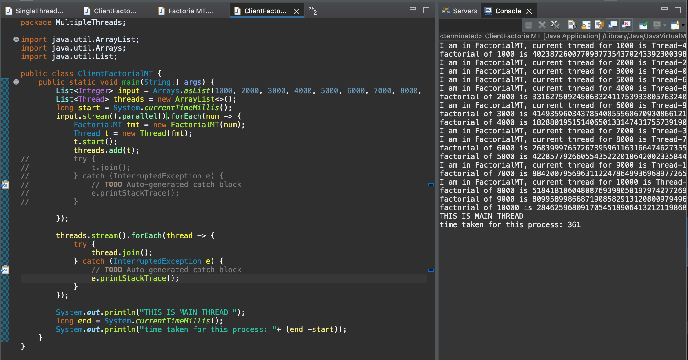

# Learn-JAVA--multithreading

# Process vs Thread
1. Process is a software or a program which include multiple functionalities. Each process will have a separate memory space, resources allocated so that you can complete tasks. 
2. Thread is a segment of a process. In a process, multiple threads can present. Each thread can perform, for example, a functionality of the software. 
3. Threads will be working sequentially or concurrently in order to complete tasks of the process. 

# Multitasking
1. Means doing multiple tasks simlutenously. In computing,we want to multitasking because we want to utilise the CPU processing power efficiently. We can complete more tasks within shorter time and reduce the idle time. This comes down to handling user-request at a faster pace.
2. Multitasking includes multiprocessing and multithreading
3. Multi-processing means multiple programs/ applicaitons running concurrently on your computer. Each time you start an applications ( browser, MS word, etc) a process is created. When you start multiple applications, multiple processes are created and running cocurrently on your system. If a process is crashed, it wont affect the others. 
4. Multi-threading allows parts of the program running concurrently ( e.g: watching the video + listening to the audio of the video).One thread might be responsible for playing the video, another thread is responsible for playing the audio. If one thread is crashed, it will affect the other thread because threads need to work together to complete the major task.  

# Multi-threading in JAVA 

1. In Java, it can be achieved via Thread class. 
2. Thread scheduler decides which thread to run and which thread to wait
3. All of this are pretty similar to process scheduler in your operating system. 

# Main thread
1. When Java program starts, one thread is created by JVM automatically and it run immediately. This thread is "main" thread. When we write a program and run without creating a new thread, we are running in single thread environment.
2. Main thread is responsible for starting the program, setting up necs resources and spawning child threads to perform concurent tasks.   
3. Main thread is normally where we create a new thread ( spawn a new thread). The new thread created is called a child thread of the main thread
4. Main thread normally the last thread to finish execution because it performs various shutdown actions. The main thread waits for all other threads to complete their executions before it itself finishes. This is to ensure that all parallel tasks have been completed and resources are properly managed. 
5. Various shutdown actions such as: cleaning up resources ( closing files, releasing network connections); ensuring all child threads are terminated gracefully; performing final logging or cleanup tasks
6. One common way to ensure the main thread waits for child threads to complete is by using the join() method. This method blocks the main thread until the specified child thread terminates.

# Two type of thread

1. User-defined thread: is responsible for the execution of something required for your program such as calculation, get output, etc.

2. Daemon thread: this thread is created when we start the program. It is created by JVM. 

In order to make a thread daemon thread: 

```java
thread.setDaemon(true);
...
```

- Characteristics of daemon thread: this thread will run in the background, hence your program will not wait for it to get completed. In other words, this is a low priority thread created by JVM to perform additional tasks such as gabage collection. Daemon thread will keep running eventhough your program has terminated. 

- When to use daemon thread: when we don't want the task to block the main task in execution. 

- One thing to note is that if we use thread.sleep() in other threads and let the daemon thread happens then it will happen before those other threads. Otherwise, if daemon has not completed its task when the main thread completed, it will keep running and not blocking the main thread, even in the case that daemon might throw an exeption. Daemon can complete its task either before or after main, but it wont affect main's operation. 

# User-defined thread
 Two ways of creating a Thread: extending Thread class or implementing Runnable interface. 

 ## creating a thread as a child of the Thread class

 Step 1: Create a class that extends the Thread class: 

 ```java
 public class A extends Thread {

 }
 ```

 Step 2: Override the run method of the Thread class. This is the function that we want this new child thread to run. Note that: to override any method, we needs to keep the method definition as it is, no changing to parameters or return type. 

 ```java
 public class A extends Thread {
    @Override
    public void run(){
        //code
    }
 }
 ```
Step 3: Write logic of run() method . 

Step 4: In main method, create an instance of the newly created child Thread class. At this stage, an instance of Thread class is created but still a single thread is running only which is the main thread

```java
A t1 = new A();
```

Now we want to inform JVM that t1 is the new thread created and you can execute it when you are free. To inform JVM, we call .start() method of the Thread class

Step 5: start the thread : t1.start() 

When you start() the thread t1.start() multiple times, Illegal Thread State Exception will be thrown. This is caused inside the .start() method by: 

```java
...
if (threadStatus != 0)
            throw new IllegalThreadStateException();

```

when you create a thread, the thread has "new" status. It becomes 0 when you start it. When you start() again, the status is modified from 0, so it results in !=0 and exeption is thrown. 

If no exeption is thown, private native void start0() is evoked. The return type " native" indicates that this methods involves directly with the CPU and memory allocation related. Start0 () is responsible for creating your new thread and evoke run() method. Test: if we evoke run() diretly, e.g: t1.run() without going through t1.start() --> no new thread is created. 

The run() method we overridden in the thread child class is executed instead of the parents' run method. 

After start() is called, two threads are running. Thread scheduler will handle two threads simultaneously

In order to know which Thread are running, we use:

```java
System.out.println(Thread.currentThread().getName())

```

ADVANTAGES of creating a threat by extending the thread class:  We do not need to create object of thread class in main

However, it will be less flexible if later we would like the implemented class to extend other class than Thread. 

## creating a thread as implementation of Runnable interface

Step 1: Create a class that implements Runnable interface

```java
 public class B implements Runnable {

 }
 ```

Runnable is a functional interface with only 1 abstract method : run()

Step 2: Override the run() method

Step 3: Write the logic of run() method

Step 4: In main method, create an object of the class we created in previous step

```java
main() {
    B t2 = new B();
}
```

To inform JVM about this new Thread and whenever possible execute this new thread. Since Runnable does not have any .start() method to create new thread like Thread class, we have to create an instance of Thread class to use .start()

Step 5: Create an instance of Thread class and supply the runnable instance we created in step 4 as its argument

Step 6: Start the thread

```java
main() {
    B t2 = new B();
    Thread thread = new Thread(t2);
    t2.start()
}
```

thread will be responsible for execute the task you wrote inside the Runnable implementation class. 

Whenever you provide runnable task, that task is assigned to FieldHolder in its constructor which assign your task to its task parameter

## If we have two threads both execute the same task, is there any order that threads start? 

The second thread.start() is not happening after the first thread.start() because it does not wait for the first one to finish to start its operation. 

## THREAD - PROPERTIES

1. Name: this is the thread's name and we can specify this as argument when we call an instance of the Thread class. For example: 

```java
Thread t  = new Thread ("thread1");
```

2. Priority: Every thread has priority spanning from 1 to 10. The default value if we do not specify this property is 5. Thread has higher priority run first. We can specify this: 

```java
t.setPriority(10);
```
3. Group: provide the parents' thread from which this thread is created.


# MULTIPLE THREADS

Questions: calculate and return factorial of a number given in a list

## Using stream and lambda expresion, we have solution : 


1. Now if we give bigger number list : {1000,2000,3000...10000}. Results will be 0 because their values come out of Integer range. 

2. To fix this, we need to change from int to BigInteger type


3. However we can notice that time taken to execute increased significantly. To reduce the time taken, we use parallel stream

```java
input.stream().parallel().forEach(num ->{
//		int res = factorial(num);
		BigInteger res = factorial(num);
		System.out.println("factorial of "+ num + " is "+ res); 
	});
```

Time taken to perform now reduced from over 500 to 365 milliseconds!

## implementing solution using Runnable 

1. Instead of writting function factorial() in main as above, we create a class implementing Runnable


2. In main, instead of calling factorial() function, we implement steps to create an instance of the Runnable implemented class and Thread class.


3. As we can see in the results above, multiple threads are created but it runs without any order. Similarly, the main thread will not wait for all spawn threads to complete their operations before it starts. In terms of Lentency, if we place start_time and end_time in main, it will not give the accurate result of how much time does it takes to complete the whole process. 

4. In order to make Main thread waits for spawn threads, we use .join() method


When you join(), the current thread will not execute until the thread on which the .join() method was called has completed its execution. This is particularly useful when you need to ensure that certain threads have finished their tasks before proceeding further in the program

5. Notes that even though the order of threads are not mixed up in the screenshot, the join() method only ensures that the main thread waits for spawn threads, but does not influence the order in which spawn threads execute their tasks. The execution order of the threads is determined by the JVM and the underlying OS's thread scheduler, not by the order of the join() calls. 

6. One disadvantage of using join() is that since we make the main thread to wait and each spawn thread execute in start() then join() sequence, it takes more time or increase the lentency of the program. 

7. Now to fix that, we want to make this process parallel: start() all the threads then join() later: start() start() stat() ... join() join()...join(). 
First, we will create an ArrayList of threads and whatever thread we initiate, we add to that list:

```java
Thread t = new Thread();
threads.add(t);
```

Then secondly, instead of using join() after start(), we create another stream to join all the threads we have started in the thread list. 

```java
thread.stream().forEach(thread -> thread.join());
```

As a result, the end time calculation will not be executed until we start all threads and complete all of their operations.

8. We can also enhance the performance by using parallel streams instead of iterating sequentially


